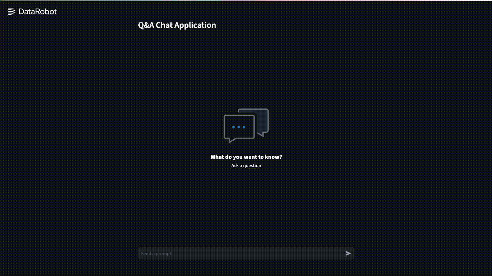

# Q&A Custom Application Template



## What's in this repository?
In this repository you will find the Q &amp; A Streamlit application code template that is used within DataRobot.

The application uses a styling library for Streamlit called `streamlit-sal`, read more
on https://github.com/datarobot-oss/streamlit-sal

## How do I set it up?

You can run the app in DataRobot via Custom Applications or run the Streamlit app directly.
Custom Applications can be created either via the registry workshop or
using [DRApps](https://github.com/datarobot/dr-apps/blob/main/README.md)

Make sure to define the variables for the app to talk to DataRobot. If you run the app from local or another environment
than DataRobots custom applications you'll need to set the env variables. When this app is run via
custom applications workshop they should be set automatically and via runtime parameters set in the app source.

```shell
export token="$DATAROBOT_API_TOKEN"  # Your API token from DR developer tools page
export endpoint="$DATAROBOT_ENDPOINT"  # Example: https://app.datarobot.com/api/v2/
export deployment_id="$DEPLOYMENT_ID"  # ID of the deployment
export custom_metric_id="$CUSTOM_METRIC_ID"  # Optional: Response feedback custom metric id 
```

```sh
pip install --no-cache-dir -r requirements.txt

streamlit-sal compile
streamlit run --server.port=8080 qa_chat_bot.py
```

or simply run the `start-app.sh` directly from the project root:

```sh
./start-app.sh
```

## How do I modify it?

The app is split into multiple files to make it easy to modify:

- `qa_chat_bot.py`: The main app function that includes all other necessary files. Here you can modify the basic page
  configuration (title, favicon, width) and add any additional elements such as sidebar or links to additional subpages.
- `constants.py`: This file contains all translatable strings, app and user configuration.
- `components.py`: Here you will find the render functions for both customized and default streamlit elements used
  within the app.
- `dr_requests.py`: In this file you will find all DataRobot API request functions.
- `styles/main.scss`: This SASS stylesheet will be compiled to CSS on app start, it is used to customize Streamlit
  native components via SAL. You can compile it manually by running `streamlit-sal compile`.
- `styles/variables.scss`: Here you can modify various CSS variables such as colors, or borders.
- `.streamlit/config.toml`: This is the Streamlit configuration file. Under `[theme]` you can define your own app
  colors. Please note that a full app restart is necessary for the values to take effect.

## Custom Metric: Feedback

Feedback buttons on LLM responses will only appear if the CUSTOM_METRIC_ID env variable has been set/
Here is an example of a metric for thumbs up and down, you can add it under your Console -> Deployment -> Monitoring ->
Custom metrics
